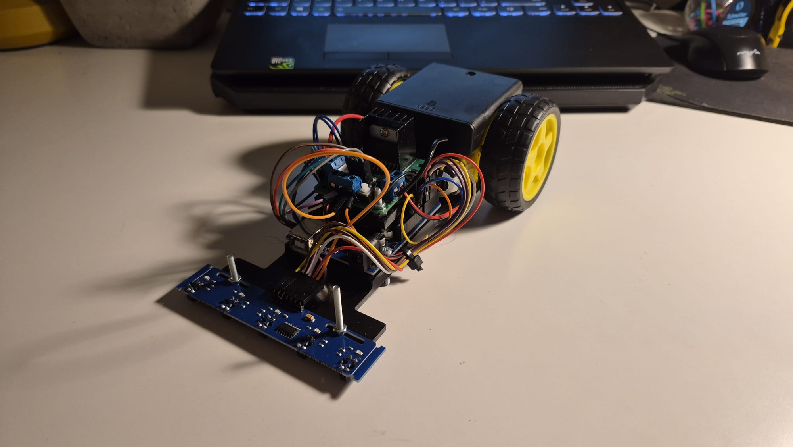

# Line-Follower

A simple line follower robot built using an ESP32 and infrared sensors. The robot detects and follows a line on the ground using basic control logic.

Watch Demo: https://youtu.be/aXs3XGMi7pI

##  What I learned
- DC motor control throught a LN298 bridge
- The basics of feedback loops

## Challanges
- Cadding the whole chassy and holders for the electronic components
- Feeding all the components current from one single battery

## Limitations
- The motors are relativley slow and can be improved
- The project uses a Arduino UNO as a main control board and this means that the whole robots decision making process is slow 